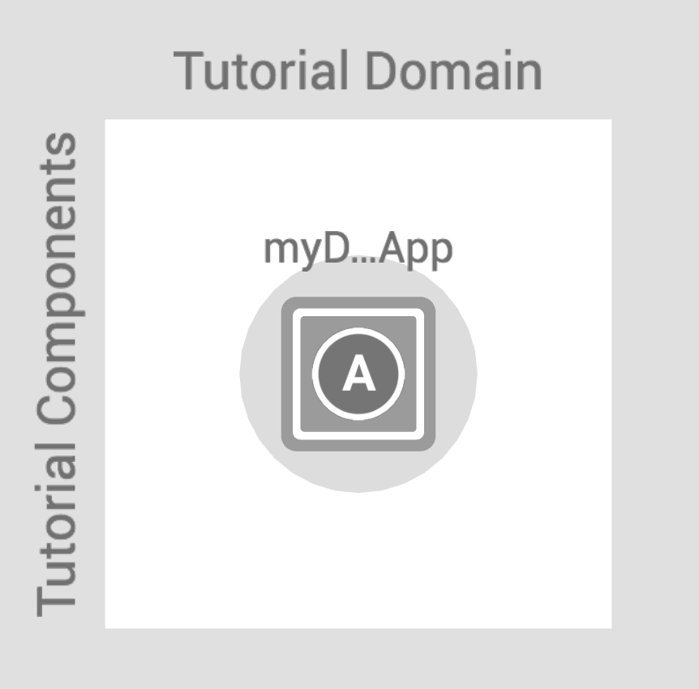
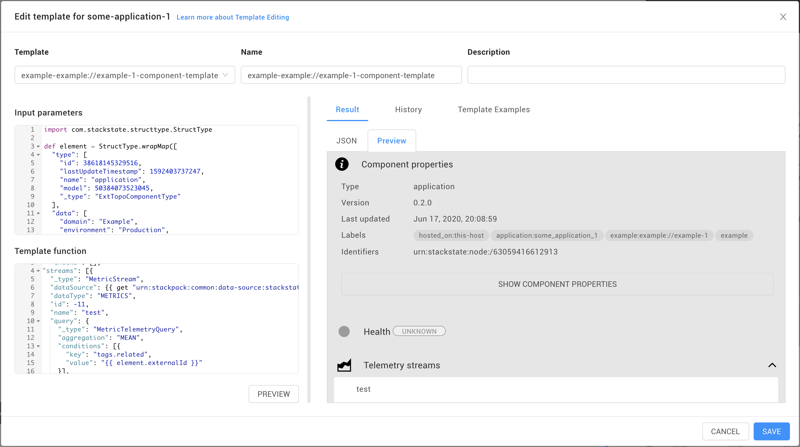
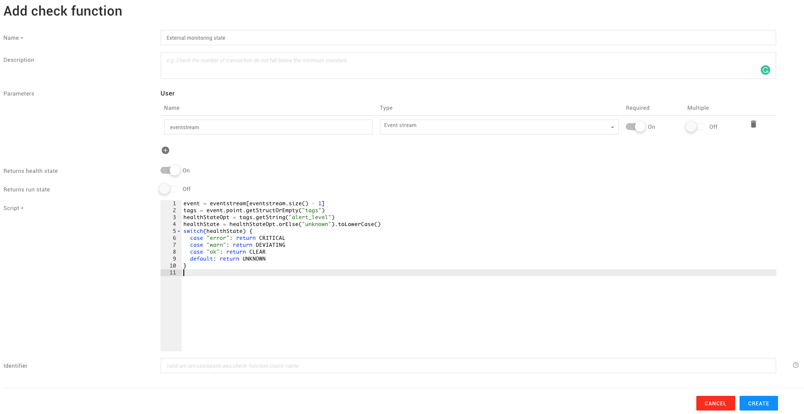
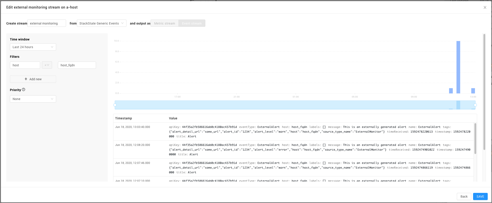
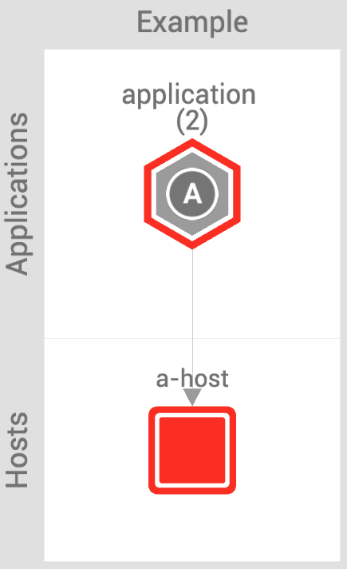

# Basic StackPack tutorial

This tutorial shows you how to create a basic StackPack to configure StackState. See the [StackPacks documentation](../../integrations/introduction.md) for more information.

## Setup

[This repository](https://github.com/mpvvliet/stackpack-tutorial) contains a sample project that containing a very basic StackPack. Clone the repository to your laptop to get started.

The repository contains a StackPack that configures StackState to receive external data and turn that into topology. The main configuration of the StackPack is in the `src` folder. 

The StackPack uses the `sbt` build tool to build a StackPack binary file. Build configuration is stored in the `build.sbt` and `version.sbt` files. The `project` directory contains the necessary build logic.

## What's in the StackPack?

The tutorial StackPack is fairly basic. It contains configuration information that configure StackState to receive a specific data format and turn this into topology.

Specifically, the StackPack contains:

* A [Groovy](https://groovy-lang.org/) provisioning script that installs the components of the StackPack \(`TutorialProvision.groovy`\)
* A component and relation template that tell StackState how to process incoming data into components and relations \(`tutorial-component-template.json.handlebars` and `tutorial-relation-template.json.handlebars`\)
* [Groovy](https://groovy-lang.org/) component and relation id extractor scripts that tell StackState how to extract the identifiers from the incoming data \(`Tutorial component id extractor.groovy` and `Tutorial relation id extractor.groovy`\)
* [Markdown](https://en.wikipedia.org/wiki/Markdown) files and images that are shown in the StackState GUI when users interact with the StackPack \(in the `resources` directory\)
* A configuration file that describes all components of the StackPack \(`stackpack.conf`\)

Take a moment to locate these files in the `src/main/stackpack` folder of the project.

## Building the StackPack

The first step is to build the StackPack into a binary file with extension `.sts` that we can send to StackState. The `sbt` build tool can be downloaded from the [SBT website](https://www.scala-sbt.org/).

Use the following command to build the StackPack:

```text
sbt package
```

If you have never run `sbt` before, the tool will download a number of dependencies before packaging your StackPack. The output from the build tool will look similar to the following:

```text
> sbt clean package
[info] Loading settings for project global-plugins from build.sbt ...
[info] Loading global plugins from /Users/martin/.sbt/1.0/plugins
[info] Loading settings for project stackpack-tutorial-build from plugins.sbt ...
[info] Loading project definition from /Users/martin/Dev/Workspace-sts/stackpack-tutorial/project
[info] Loading settings for project root from version.sbt,build.sbt ...
[info] Set current project to tutorial (in build file:/Users/martin/Dev/Workspace-sts/stackpack-tutorial/)
[success] Total time: 0 s, completed Jul 8, 2020 4:23:09 PM
[info] Packaging /Users/martin/Dev/Workspace-sts/stackpack-tutorial/target/tutorial-0.0.3-master-SNAPSHOT.sts ...
[info] Done packaging.
[success] Total time: 1 s, completed Jul 8, 2020 4:23:10 PM
```

The final binary StackPack is located in the `target` directory and is named `tutorial-0.0.2-master-SNAPSHOT.sts` or something similar. 

## Importing the StackPack

The StackPack must be imported into StackState before it can be installed. This can be done using the [StackState CLI](../../setup/cli.md). Please make sure it is installed and configured to connect with your StackState instance.

The following command installes our new tutorial StackPack in StackState:

```text
sts-cli stackpack upload target/tutorial-0.0.2-master-SNAPSHOT.sts
```


The StackState CLI requires a `conf.d` configuration folder in the directory it is running from. This may require you to run the CLI from a different location. If so, remember to use an absolute path to refer to the StackPack binary.


We are now ready to install our tutorial StackPack.

## Installing the StackPack

Open the StackState application in your browser and log in. Navigate to the **StackPacks** page that lists all available StackPacks. You should see our Tutorial StackPack in the list of StackPacks.

Open the Tutorial StackPack page. Here you see the installation instructions that are part of the StackPack \(in the `src/main/stackpack/resources` directory\). Install the StackPack with the **Install** button.

If all goes well, your StackPack should be installed and in the _Waiting for data_ stage. This means the StackPack is ready to receive data, but hasn't yet received any. The StackState GUI tells you how to send data into the StackPack.

If you want to use the manual approach, copy the JSON listed in the StackPack page to your laptop and use the supplied `curl` command to send it to StackState.


The JSON and `curl` command shown in StackState contain data fields specific to your StackState installation, such as your API key and StackState URL.


When the StackPack has received your data, it will show a message indicating success and allowing you to explore your data.

## Seeing the topology in StackState

When you log into your StackState instance, go to the **Explore Mode**. Using the topology filter, select all topology with the `tutorial` label. This should result in a topology similar to the following:



Note that the components you see are hardcoded in the JSON data. The components appear in the **Tutorial Domain** domain and **Tutorial Components** layers.

Click on the component to open the **Component Details pane**. You'll see the component's labels and other meta-data you sent.

## Adding a custom telemetry stream to all components of a type

The **some-application-1** component now has our telemetry stream. The sample check, however, also produces telemetry for the second application component. To map a stream to all components of a certain type, we need to update the component's _template_.

Select the **some-application-1** component again and in the Component Details pane, find the triple dots menu in the top-right corner. There, select the **Edit template** option. This brings up the **Template Editor**.

In the Template Editor you can edit the template used to create components based on data coming in from your sample check. It shows the following information:

* Input parameters -- this is the data sent by our example check that is processed by StackState
* Template function -- this is the template that uses the input parameters to create a component
* Component preview -- this is a preview of the component produced by applying the input parameters to the template function


Check out the **Template Examples** tab in the Template Editor to learn how to create templates.


The easiest way to add a stream to the component is to select **New template** from the Template dropdown. This will render a new template for your current component.

Find the `streams` property in the Template function text area and copy it to your clipboard.

Now switch back to the `example-example://example-1-component-template` in the Template dropdown.

In the Template function, replace the `streams` part with the code you copied earlier.

Notice that the telemetry query we are using is selecting the `tags.related` key and `some-application-1` for the value. This is correct for one of our components, but not for the other. We need to make this value dynamic.

Using the double curly notation, we can use dynamic values from our input data. Go ahead and replace the `some-application-1` with a reference to the component's external id:

```text
{{ element.externalId }}
```

The end result should look something like this:

```text
"streams": [{
  "_type": "MetricStream",
  "dataSource": {{ get "urn:stackpack:common:data-source:stackstate-metrics"  }},
  "dataType": "METRICS",
  "id": -11,
  "name": "test",
  "query": {
    "_type": "MetricTelemetryQuery",
    "aggregation": "MEAN",
    "conditions": [{
      "key": "tags.related",
      "value": "{{ element.externalId }}"
    }],
    "id": -13,
    "metricField": "example.gauge"
  },
  "syncCreated": false
}],
```



Go ahead and save the template. Be aware that you may need to _unlock_ it before this succeeds.

Now, we need to reset the synchronization so it will reprocess the incoming data. Go to the **Settings** area and find the **Synchronizations** page. There, use the kebab menu to reset the `Synchronization example example://example-1` synchronization.

If you go back to the topology, you'll see that both application components \(and any you might add in the future\) will have the stream there.

## Setting a component's health state from an external source

StackState calculates the health state of a component using a metric stream and one of the many check functions it ships with. It is also possible to create your own check function that interprets events from an external source, such as another monitoring tool, and use it to set the component's health state. Let's try that out on our **a-host** component.

Let's start by creating the check function that takes the incoming data and translates it to a health state. Go to the **Settings** area and find the **Check functions** page. Click the **Add Check function** button to create a new check function. Name the function **External monitor state**.

Our check functions will work on an event stream, so add a parameter to the function using the **plus** button. The parameter name is `eventstream` and it's type is, indeed, `Event stream`.

Use the following code for the check function:

```text
event = eventstream[eventstream.size() - 1]
tags = event.point.getStructOrEmpty("tags")
healthStateOpt = tags.getString("alert_level")
healthState = healthStateOpt.orElse("unknown").toLowerCase()
switch(healthState) {
  case "error": return CRITICAL
  case "warn": return DEVIATING
  case "ok": return CLEAR
  default: return UNKNOWN
}
```

Here is what that looks like:



Finally save the check function.

Now, let's create some test events for the component. Provided you have set the correct environment variables, the following command sends events into StackState:

```text
TS=`date +%s`; cat custom-event.json | sed -e "s/##TIMESTAMP##/$TS/" | curl -H "Content-Type: application/json" -X POST -d @- ${STS_STS_URL}/intake/\?api_key\=${STS_API_KEY}
```

Just execute a few of these so we have a few datapoints to work with.

Next, let's create an _event stream_ for the component. Find the **a-host** component and open the Component Details pane. In the **Telemetry streams** section, click on the **Add** button. This opens the Stream Wizard and allows you to add a new stream. Enter **External monitor** as the name for the stream and select the **StackState Generic Events** datasource.

In the Stream Creation screen, select the **Event stream** type at the top. Then fill in the following parameters:

* Time window: Last hour
* Filters: `host` = `host_fqdn`

Here is what that looks like:



You should already see the test events you sent. Go ahead and save the stream.

The last thing to do is to add a health check to the **a-host** component. In the **Health** section, click on the **Add** button. This opens the Check Wizard and allows you to add a new check. Enter **External monitor** as the name for the check and, under the **Check function**, select our **External monitoring state** check. StackState should automatically select the **External Monitoring** event stream. Save the check by clicking the **Create** button.

Now, sending in the events using the command below should set the health state to `CRITICAL`:

```text
TS=`date +%s`; cat custom-event.json | sed -e "s/##TIMESTAMP##/$TS/" | curl -H "Content-Type: application/json" -X POST -d @- ${STS_STS_URL}/intake/\?api_key\=${STS_API_KEY}
```

You can change the `alert_level` field in the `custom-event.json` file to try out different values, such as `error`, `warning` and `ok`. The component should change it's state a few seconds after receiving the event.

When the component turns `CRITICAL`, this is what you should see:



## Cleaning your StackState instance

When you are done with this tutorial, you can remove the configuration from your StackState instance as follows:

* Uninstall the **Custom Synchronization StackPack**. This will remove the configuration and data received \(topology\) from StackState.
* Remove any check functions you added

